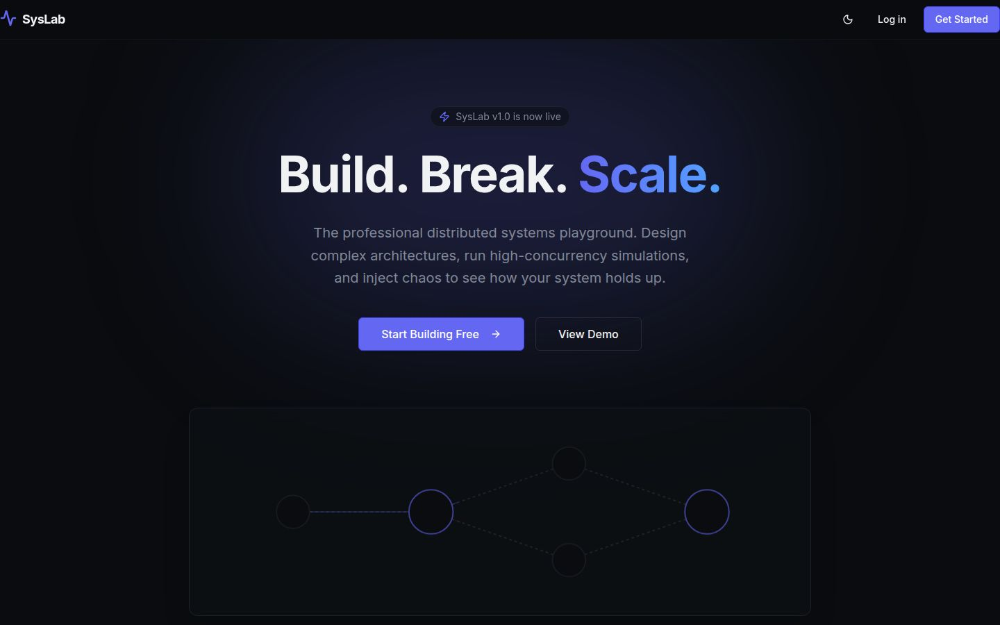
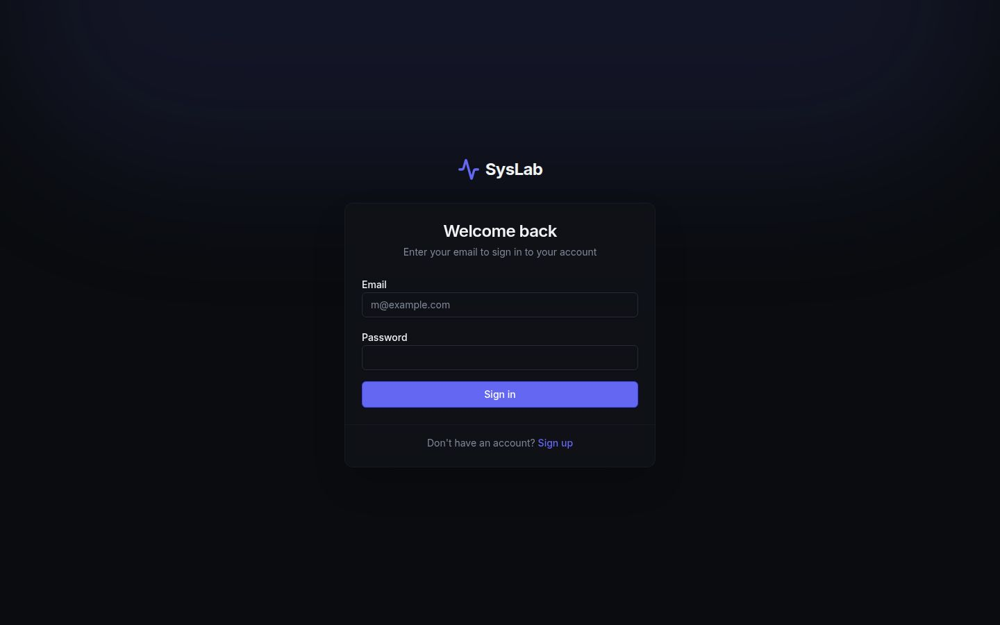
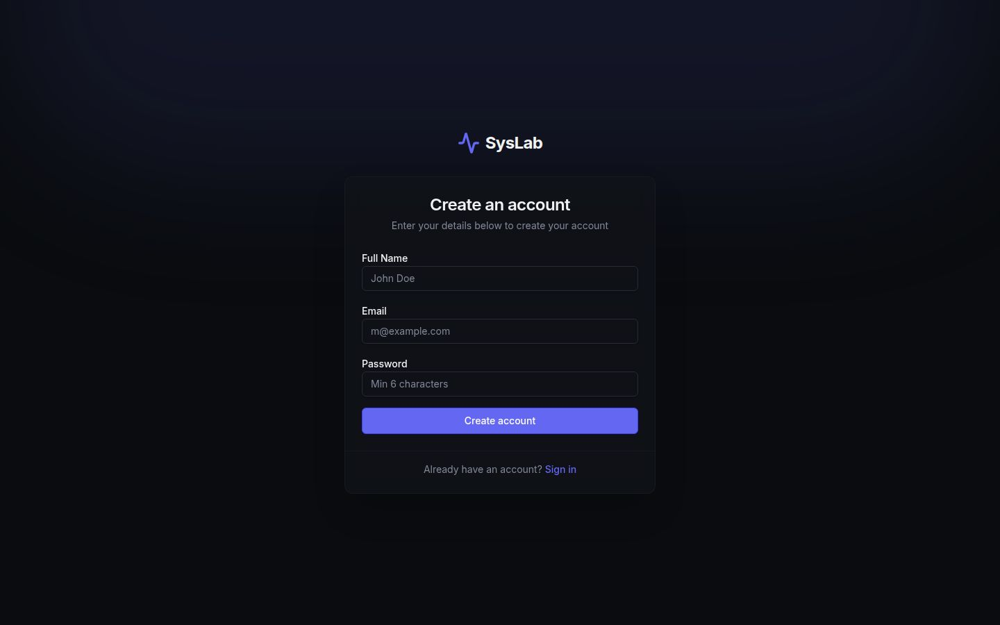

# SysLab — Build. Break. Scale.

An interactive distributed systems playground. Design architectures on a canvas, simulate traffic through them, inject failures, and watch the system respond in real time.

**[Live Demo →](https://syslab-app-api-server-m3tr.vercel.app)** &nbsp;|&nbsp; **[Report Bug](https://github.com/Sriyamalhar/syslab-app/issues)**

---



---

## What it does

| Module | Description |
|---|---|
| **Canvas** | Drag-and-drop 40+ node types (servers, databases, queues, CDNs, etc.) onto an infinite canvas. Connect them, undo/redo, export/import JSON. |
| **Simulation** | Hit Run — traffic propagates through your topology with realistic latency, queueing, and capacity modelling. |
| **Chaos** | Inject failures: Kill Server, Crash DB, Disconnect Network, High Latency, Packet Loss, DNS/Auth/Cache Failure, API Timeout. |
| **Monitoring** | Live charts per node — req/s, CPU, latency, error rate, health. |
| **Projects** | Save architectures to your account. Start from a blank canvas or pick a template (Microservices, Event-Driven, Three-Tier, Kubernetes). |

---

## Screenshots

| Auth | Canvas Editor |
|---|---|
|  |  |

---

## Stack

- **Frontend** — React 19, Vite, Tailwind CSS v4, React Flow v12, Zustand, Recharts, Framer Motion
- **Backend** — Express 5, Node.js 24, JWT auth (bcryptjs + jsonwebtoken)
- **Database** — PostgreSQL + Drizzle ORM
- **Monorepo** — pnpm workspaces, TypeScript 5.9, OpenAPI 3.1 + Orval codegen

---

## Running locally

```bash
git clone https://github.com/Sriyamalhar/syslab-app.git
cd syslab-app
pnpm install

# set up environment
cp .env.example .env
# fill in DATABASE_URL and SESSION_SECRET

pnpm --filter @workspace/db run push          # apply schema
pnpm --filter @workspace/api-server run dev   # API on :8080
pnpm --filter @workspace/syslab run dev       # frontend on :5173
```

**Environment variables**

| Variable | Description |
|---|---|
| `DATABASE_URL` | Postgres connection string |
| `SESSION_SECRET` | JWT signing secret |
| `VITE_API_URL` | (production) URL of the deployed API server |
| `CORS_ORIGIN` | (production) comma-separated allowed origins |

---

## Deploying

**Frontend → Vercel**
Import `Sriyamalhar/syslab-app` on Vercel. Set root directory to `artifacts/syslab`. Add `VITE_API_URL` pointing to your deployed API.

**API → Railway / Render**
Point at `artifacts/api-server`. Set `DATABASE_URL`, `SESSION_SECRET`, and `CORS_ORIGIN` (your Vercel URL).

---

## License

[MIT](LICENSE) © 2026 Sriya Malhar
