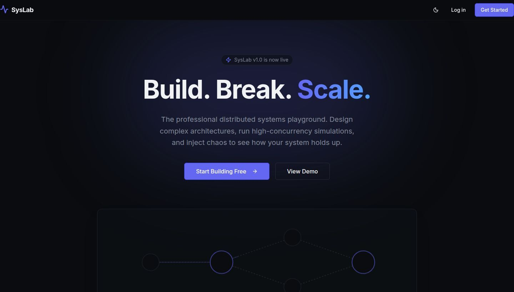
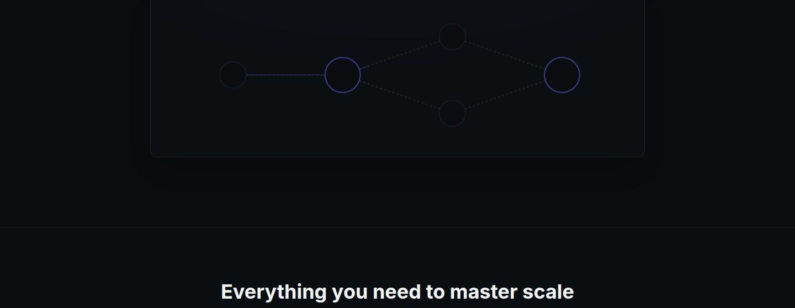
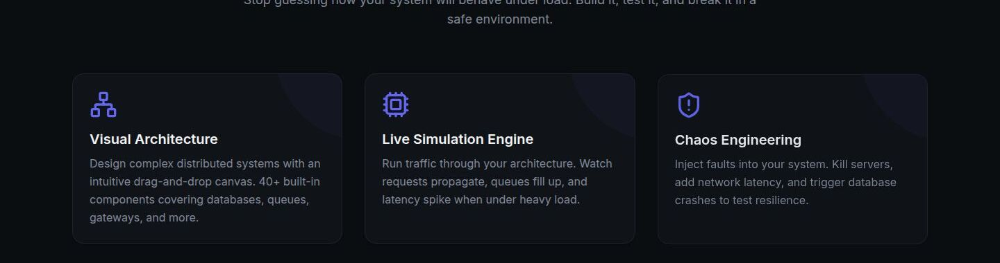

# SysLab

> **Build. Break. Scale.** — An interactive distributed systems playground.

Design complex architectures on a drag-and-drop canvas, simulate real traffic through them, inject chaos failures, and watch live metrics respond — all in the browser.

**[Live Demo →](https://syslab-app-api-server-m3tr.vercel.app)** &nbsp;·&nbsp; **[Report an Issue](https://github.com/Sriyamalhar/syslab-app/issues)**

---



---

## Features



| | |
|---|---|
| **Visual Canvas** | Drag-and-drop 40+ components — servers, databases, queues, CDNs, load balancers — onto an infinite canvas and wire them together. |
| **Live Simulation** | Hit Run and watch requests propagate through your topology with realistic latency, queueing, and capacity modelling. |
| **Chaos Engineering** | Inject failures mid-simulation: Kill Server, Crash DB, High Latency, Packet Loss, DNS/Auth/Cache failure, API Timeout. |
| **Real-time Monitoring** | Per-node Grafana-style charts — req/s, CPU, latency, error rate, health score. |
| **Templates** | Start from Microservices, Event-Driven, Three-Tier, or Kubernetes pre-built topologies. |



---

## Stack

- **Frontend** — React 19, Vite, Tailwind CSS v4, React Flow v12, Zustand, Recharts, Framer Motion
- **Backend** — Node.js 24, Express 5, JWT auth (bcryptjs + jsonwebtoken)
- **Database** — PostgreSQL + Drizzle ORM
- **Monorepo** — pnpm workspaces, TypeScript 5.9, OpenAPI 3.1, Orval codegen

---

## Running locally

```bash
git clone https://github.com/Sriyamalhar/syslab-app.git
cd syslab-app
pnpm install
cp .env.example .env        # fill in DATABASE_URL and SESSION_SECRET
pnpm --filter @workspace/db run push
pnpm --filter @workspace/api-server run dev   # API → :8080
pnpm --filter @workspace/syslab run dev       # UI  → :5173
```

---

## Deploying

| Service | Where | Config |
|---|---|---|
| Frontend | Vercel | Root dir = repo root, env: `VITE_API_URL=https://syslab-app.onrender.com/api` |
| API | Render | Build: `NODE_ENV=development npx --yes pnpm@10 install && npx pnpm@10 --filter @workspace/api-server run build` · Start: `node --enable-source-maps artifacts/api-server/dist/index.mjs` |

---

## License

[MIT](LICENSE) © 2026 Sriya Malhar
